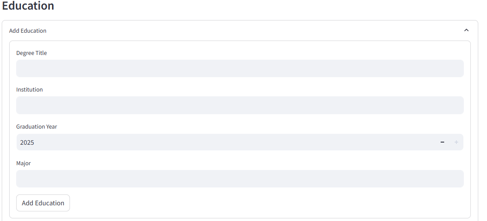
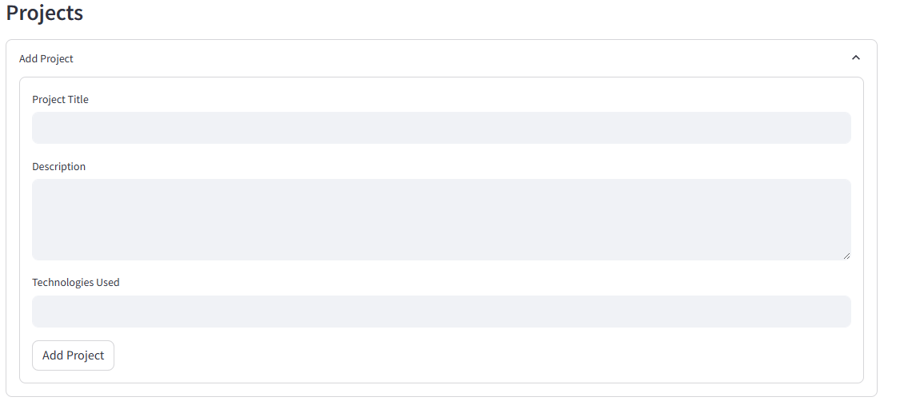
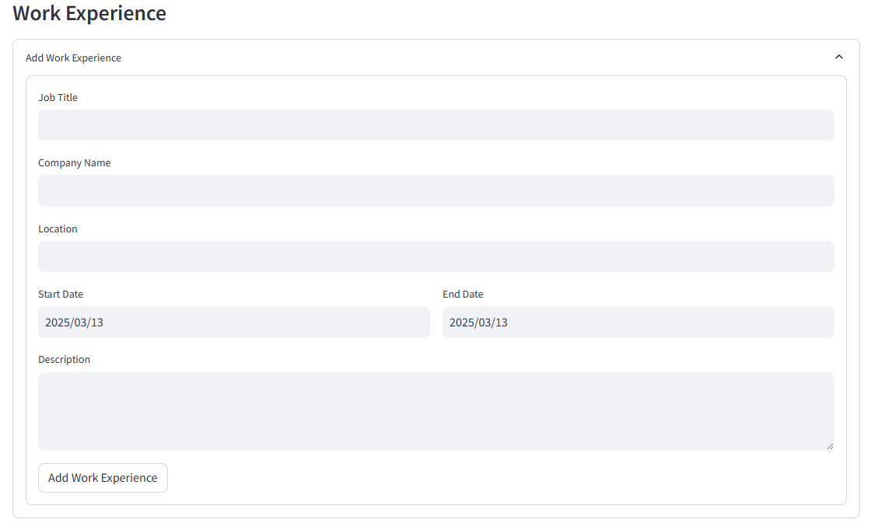

# AI Resume Generator

## Table of Contents

- [Project Overivew](#overview)
- [Features](#features)
- [Overview](#overview)
- [Getting Started](#getting-started)
  - [Prerequisites](#prerequisites)
  - [Installation](#installation)
  - [Usage](#usage)
- [How It Works](#how-it-works)
- [The Program](#the-program)
- [Contributing](#contributing)
- [Presentation](#presentation)
- [License](#license)
- [The Team](#the-team)

## Project Overview

### Overview

This project aims to create a user-friendly application designed to help users create professional and polished resumes quickly. The project leverages Python, Machine Learning, Neural Network to generate Resume and/or Cover Letter and Streamlit to provide an interactive interface where users input their details, such as personal information, work experience, education, skills, and certifications. The application then formats the data into a structured resume template, ensuring clarity and professionalism.

## Features

- **AI-Powered cover letters** tailored to job descriptions and company details.
- **AI-Powered Content Generation:** Analyzes user input (skills, experience, education) and generates relevant resume content.
- **Natural Language Processing (NLP):** Extracts key information from user input and understands context.
- **Keyword Optimization:** Suggests relevant keywords based on job descriptions.
- **Automatic Formatting:** Ensures consistent and professional resume formatting.
- **Downloadable Formats:** Supports PDF, DOCX, and other common resume formats.
- **User-Friendly Interface:** Provides an intuitive and easy-to-use experience.


### Prerequisites

Before you begin, ensure you have the following installed:

- Python 3.8+
- pip (Python package installer)
- [List any specific libraries, e.g., TensorFlow, PyTorch, Streamlit, etc.]
- wkhtmltopdf (for PDF conversion)
- Streamlit for generating user interface

### Installation

1. Clone this repository:
   ```bash
   git clone https://github.com/your-repo/resume-cover-letter-generator.git
   cd resume-cover-letter-generator
   ```
2. Install dependencies:
   ```bash
   pip install -r requirements.txt
   ```
3. Set up OpenAI API key:
   ```python
   openai.api_key = "your-api-key-here"

### Usage

1. Run the application:

   ```bash
   streamlit run app.py # If using streamlit.
   python main.py # If a standard python app.
Open your web browser and navigate to http://localhost:8501 (or the appropriate address).

Follow the on-screen instructions to input your information and generate your resume.

### How It Works:

The AI Resume Builder utilizes the following technologies:

- **Natural Language Processing (NLP):** [Briefly explain the NLP techniques used, e.g., tokenization, entity recognition, sentiment analysis].
- **Machine Learning (ML):** [Briefly explain the ML models used, e.g., text generation models, classification models].
- **[Other Technologies]:** [Mention any other relevant technologies or frameworks].

The process involves:

1. **User Input:** The user provides their information through the web interface.
2. **Data Processing:** The input is processed using NLP techniques to extract key information.
3. **Content Generation:** The AI models generate resume content based on the extracted information.
4. **Template Application:** The generated content is applied to the selected resume template.
5. **Formatting and Optimization:** The resume is formatted and optimized for keywords.
6. **Output:** The user can download the resume in the desired format.

### The Program

  **Real World Application**

The Resume Generator has real-world applications across various industries by streamlining the resume creation process for job seekers. Whether for recent graduates, career changers, or professionals looking to update their resumes, this tool provides a fast, efficient, and user-friendly way to craft well-structured, professional resumes.

Recruiters and hiring managers often prioritize well-formatted resumes, and this program ensures consistent styling, clear organization, and ATS (Applicant Tracking System) compatibility, improving the chances of landing interviews. Additionally, businesses and career coaching services can integrate this tool into their platforms to assist clients in resume-building, making it a valuable asset in the job market.

**How to Generate a Cover Letter**

Modify `test_user_info` with your details and run:

```bash
python cover_letter_generator.py
```

This will generate a Markdown file, an HTML file, and a PDF of the cover letter.

**How to Generate a Resume**

Modify `user_data` with your details and run:

```bash
python resume_generator.py
```

This will generate a professional resume in multiple formats.

**Program File Structure**

```
resume-cover-letter-generator/
|-- templates/
|   |-- resume_template.jinja2
|   |-- cover_letter_template.jinja2
|-- output/
|   |-- generated resume and cover letter files
|-- cover_letter_generator.py
|-- resume_generator.py
|-- resume.css
|-- requirements.txt
|-- README.md
```

**Dependencies**

- `openai`
- `jinja2`
- `markdown`
- `pdfkit`
- `wkhtmltopdf`
- `language_tool_python`
- `logging`

**Logging and Error Handling**

- Logs are saved to `resume_generator.log` and `cover_letter_generator.log`.
- Errors in AI generation or PDF conversion are logged and displayed.

**How it Works**


The first screen of the application serves as the user input form, where users provide essential details for generating their cover letter or resume. It includes fields for the user's full name, email, phone number, LinkedIn URL, GitHub profile, years of experience, professional summary, and key skills. The interface is designed to be clean and intuitive, ensuring a seamless experience while entering information.



The second screen allows users to input their educational background by providing details such as degree, institution, start date, end date, and additional details about their studies. Users can add multiple entries to accommodate various degrees or institutions they have attended. The interface includes an "Add Another" button, enabling users to input multiple schools seamlessly. Each entry is structured clearly, ensuring that users can easily review and edit their educational history before proceeding.



The third screen focuses on the user's project experience, allowing them to input details for each project they have worked on. Users can enter the project title, a brief description outlining its purpose and impact, and the technologies used. The interface supports adding multiple projects with an "Add Another" button, ensuring users can showcase a diverse range of work. This structured approach helps highlight technical expertise and practical experience effectively.



The final screen is dedicated to the user's work experience, where they can input details about their previous and current job roles. Users enter their job title, company name, start date, end date, and a description of their responsibilities and achievements. Like the previous sections, this screen allows users to add multiple jobs, ensuring a comprehensive work history. This structured input helps create a well-rounded resume that effectively showcases professional experience.

### Contributing

We welcome contributions to the Resume and Cover Letter Builder! To contribute:

Fork the repository.
Create a new branch for your feature or bug fix: git checkout -b feature/your-feature-name.
Make your changes and commit them: git commit -m 'Add your feature'.   
Push to the branch: git push origin feature/your-feature-name.
Submit a pull request.   

  

### License

MIT License

## Presentation

[AI Resume Generator Presentation](https://docs.google.com/presentation/d/1dYNcGzHZJ7riSncaC3UqS4uJGNvLJwGZ/edit?usp=sharing&ouid=115049080126679246379&rtpof=true&sd=true)

## The Team

[vinayakgrover](https://github.com/vinayakgrover)

[MarwaBS](https://github.com/MarwaBS)

[nabray07](https://github.com/nabray07)

[rgoldstein24](https://github.com/rgoldstein24)
